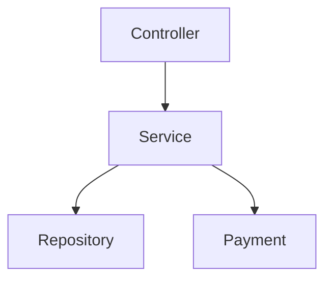
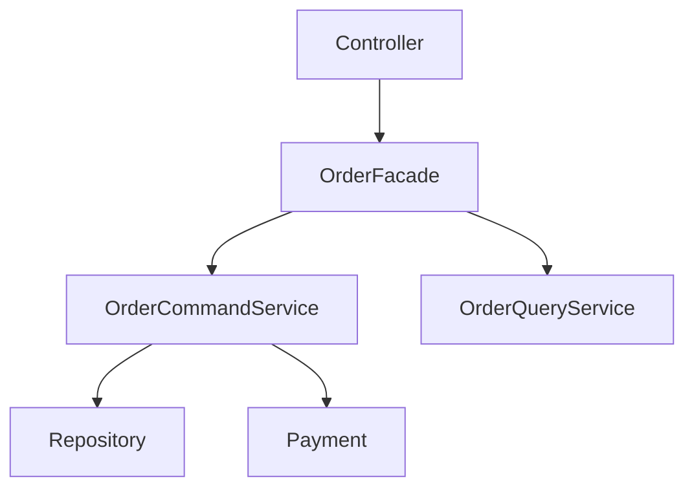

# 🎯 Playbook profesional

La idea es que **la IA no solo escriba código**, sino que **externalice el modelo mental** antes de tocar nada.

## **Think → Design → Execute → Accelerate (con diagramas)**

### Herramientas

* **Claude Code** → pensar, entender, diseñar **(diagramas primero)**
* **JetBrains Junie** → cambiar código real con seguridad
* **OpenAI Codex** → escribir código rápido y local

---

## FASE 1 — **THINK**

### Entender el sistema (sin tocar código)

**Objetivo:** construir el modelo mental correcto **y hacerlo visible**.

👉 Aquí **Claude Code SIEMPRE debe producir diagramas**.

### Qué pedirle

* “Explícame este módulo y dibuja su estructura.”
* “Representa las responsabilidades y dependencias.”
* “Qué partes están acopladas y por qué.”

### Artefacto obligatorio

#### Diagrama ASCII (visión rápida)

```
+-------------------+
| OrderController   |
+-------------------+
          |
          v
+-------------------+        +------------------+
| OrderService      |------->| PaymentService  |
| (god object)      |        | (external)      |
+-------------------+        +------------------+
          |
          v
+-------------------+
| OrderRepository   |
+-------------------+
```

#### Diagrama Mermaid (visión formal)



**Entregable:**

* Narrativa + diagramas
* Hipótesis de intención
* Lista de smells conceptuales

🚫 No Junie
🚫 No Codex

---

## FASE 2 — **DESIGN**

### Decidir qué cambiar (sin ejecutar)

**Objetivo:** explorar alternativas **antes de refactorizar**.

👉 Claude **debe comparar diseños con diagramas**.

### Qué pedirle

* “Propón 2–3 rediseños y dibújalos.”
* “Qué responsabilidades se mueven.”
* “Qué contratos se mantienen.”

### Ejemplo de rediseño (Mermaid)



### Decisión explícita

* Diseño elegido
* Qué NO se toca
* Orden de pasos

🚫 Todavía no Junie
🚫 Codex prohibido

---

## FASE 3 — **EXECUTE**

### Cambiar código real (plan en mano)

**Objetivo:** aplicar el diseño **sin romper el sistema**.

👉 Aquí **los diagramas ya están cerrados**.

**Herramienta:** **JetBrains Junie**

### Flujo mental

```
[Diagrama aprobado]
        ↓
[Aplicar paso 1]
        ↓
[Compila]
        ↓
[Tests verdes]
```

### Qué pedirle

* “Extrae OrderCommandService.”
* “Mueve esta clase respetando visibilidad.”
* “Actualiza firmas y usos.”

💡 Junie trabaja sobre **AST + tipos reales**
💡 No genera diagramas: **ejecuta el plan**

🚫 No Claude
🚫 No Codex

---

## FASE 4 — **ACCELERATE**

### Escribir código rápido (local)

**Objetivo:** velocidad sin pensar arquitectura.

**Herramienta:** **Codex**

### Cuándo usarlo

* Helpers
* DTOs
* Mappers
* Tests repetitivos
* Boilerplate

### Qué pedirle

* “Genera este mapper.”
* “Escribe tests para este caso.”
* “Completa esta función.”

🚫 No rediseños
🚫 No refactors globales
🚫 No decisiones conceptuales

---

## FASE 5 — **VALIDATE**

### Feedback loop guiado por errores

| Si el problema es…  | Vuelve a           |
| ------------------- | ------------------ |
| Conceptual          | Claude + diagramas |
| Estructural / tipos | Junie              |
| Código repetitivo   | Codex              |

---

## 🧭 Regla de oro (con diagramas)

> **Si no hay diagrama → no hay refactor
> Si no hay decisión → no hay ejecución**

---

## Tabla de decisión instantánea

| Situación              | Herramienta | Diagrama |
| ---------------------- | ----------- | -------- |
| No entiendo el sistema | Claude      | Sí       |
| Rediseño de módulo     | Claude      | Sí       |
| Elegir límites         | Claude      | Sí       |
| Refactor seguro        | Junie       | No       |
| Mover clases           | Junie       | No       |
| Escribir boilerplate   | Codex       | No       |

---

## Error crítico a evitar

❌ Ejecutar con Junie **sin diagrama previo**
→ refactor correcto, sistema peor

❌ Usar Codex para diseño
→ código rápido, arquitectura frágil

---

## Frase final

> **Claude dibuja el sistema.
> Junie lo transforma.
> Codex lo acelera.**


Perfecto. A continuación tienes la **conversión directa y operativa** del playbook en **tres archivos reales**:
**CLAUDE.md**, **JUNIE.md** y **CODEX.md**, con **prompts obligatorios**, reglas de uso y anti-patrones.

Puedes copiarlos tal cual a la raíz del repo.

---

# 📄 **CLAUDE.md**

### (Pensar, entender y diseñar con diagramas)

**Herramienta:** **Claude Code**

---

## 🎯 Rol de Claude

Claude **NO escribe código productivo**.
Claude:

* Entiende sistemas
* Explica legacy
* Detecta smells conceptuales
* Diseña alternativas
* Produce **diagramas ASCII / Mermaid obligatorios**

---

## 🚦 Cuándo usar Claude (obligatorio)

Usa Claude **SIEMPRE** cuando:

* Entras en código legacy
* No entiendes un módulo
* Vas a rediseñar responsabilidades
* Vas a hacer un refactor no trivial

🚫 Prohibido usar Claude para:

* Refactors grandes
* Cambios de firmas
* Mover clases reales

---

## 📦 Entregables obligatorios

Claude **DEBE producir**:

1. Explicación narrativa
2. Diagrama ASCII
3. Diagrama Mermaid
4. Lista de smells
5. Propuesta de diseño (si aplica)
6. Plan de pasos (sin código)

---

## 🧠 Prompts obligatorios

### 1️⃣ Entender código legacy

```
Analiza este módulo como si fueras un nuevo miembro del equipo.

REQUISITOS:
- Explica responsabilidades reales (no teóricas)
- Identifica smells conceptuales
- Dibuja la estructura actual en ASCII
- Dibuja la estructura actual en Mermaid
- Explica por qué este código probablemente evolucionó así

NO escribas código.
```

---

### 2️⃣ Rediseño de módulo

```
Propón 2–3 rediseños posibles para este módulo.

REQUISITOS:
- Explica trade-offs de cada opción
- Indica qué responsabilidades se mueven
- Dibuja cada opción en Mermaid
- Recomienda una opción y justifica por qué
- Define qué NO se va a tocar

NO escribas código.
```

---

### 3️⃣ Plan de refactor

```
Define un plan de refactor incremental y seguro.

REQUISITOS:
- Pasos numerados
- Cada paso debe ser pequeño y reversible
- Indica qué tests protegen cada paso
- NO escribas código
```

---

## ❌ Anti-patrones

* ❌ “Aquí tienes el código refactorizado”
* ❌ Cambios sin diagramas
* ❌ Decisiones sin justificar

---

# 📄 **JUNIE.md**

### (Ejecutar cambios reales de forma segura)

**Herramienta:** **JetBrains Junie**

---

## 🎯 Rol de Junie

Junie **EJECUTA** decisiones ya tomadas.

Junie:

* Opera sobre AST real
* Respeta tipos, visibilidad y referencias
* Mantiene el build verde

Junie **NO diseña**.

---

## 🚦 Cuándo usar Junie

Usa Junie **SOLO SI**:

* Existe un plan definido (normalmente desde Claude)
* El diseño está cerrado
* Hay diagramas aprobados

🚫 Prohibido usar Junie para:

* Explorar alternativas
* Rediseñar sin plan
* “A ver qué pasa si…”

---

## 🧠 Prompts obligatorios

### 1️⃣ Aplicar un paso del plan

```
Aplica el paso X del plan de refactor.

REQUISITOS:
- Respeta firmas públicas
- Mantén compatibilidad
- Actualiza todas las referencias
- No hagas cambios adicionales
```

---

### 2️⃣ Refactor estructural

```
Extrae esta responsabilidad en una nueva clase/servicio.

REQUISITOS:
- Mantén visibilidad correcta
- No cambies comportamiento
- Ajusta imports y tipos
```

---

### 3️⃣ Ajustes tras compilación

```
Corrige los errores de compilación derivados del cambio anterior.

REQUISITOS:
- Cambios mínimos
- Sin rediseñar
```

---

## ❌ Anti-patrones

* ❌ Refactor sin plan
* ❌ Cambios conceptuales
* ❌ “Mejores ideas” durante la ejecución

---

# 📄 **CODEX.md**

### (Acelerar escritura de código)

**Herramienta:** **OpenAI Codex**

---

## 🎯 Rol de Codex

Codex **ESCRIBE CÓDIGO RÁPIDO**.

Codex:

* Genera boilerplate
* Completa funciones
* Escribe tests repetitivos
* Acelera tareas locales

Codex **NO decide arquitectura**.

---

## 🚦 Cuándo usar Codex

Usa Codex cuando:

* El diseño ya está decidido
* El cambio es local
* La tarea es mecánica

🚫 Prohibido usar Codex para:

* Diseño
* Rediseño
* Refactors globales

---

## 🧠 Prompts obligatorios

### 1️⃣ Generar helper / mapper

```
Genera el código para este mapper/helper.

REQUISITOS:
- Sigue el estilo existente
- No introduzcas nueva lógica
- Código claro y directo
```

---

### 2️⃣ Generar tests

```
Escribe tests unitarios para este caso.

REQUISITOS:
- Casos felices y de error
- Nombres claros
- Sin mocks innecesarios
```

---

### 3️⃣ Completar función

```
Completa esta función según la firma dada.

REQUISITOS:
- No cambies la firma
- No rediseñes nada
```

---

## ❌ Anti-patrones

* ❌ “Mejora este diseño”
* ❌ “Refactoriza este módulo”
* ❌ Código que cambia contratos

---

# 🧭 Regla final (para el repo)

> **Sin CLAUDE.md no se piensa bien
> Sin JUNIE.md se rompe el código
> Sin CODEX.md se pierde tiempo**

